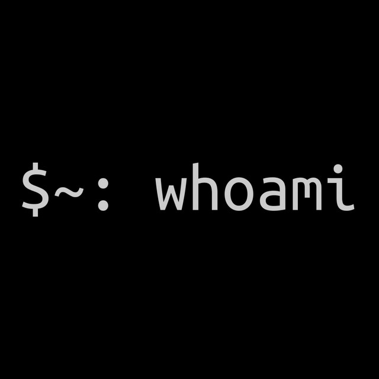

  

<h2>
	About Me:
</h2>

<ul align="justify">
	<li>🪲 Currently studying for bug bounty hunting, learning from burpsuite labs and reading hackerone writeups.</li>
	<li>💻 I also enjoy making HackTheBox machines and playing Capture The Flag.</li>
 	<li>🧑‍🎓 I plan to get BurpSuite and eCCPT certifications, probably OSCP in the future.</li>
 	<li>🐍 And finally, I like to do scripting, preferably Python and Bash, to make my life easier and automate things!</li>
</ul>

 

	 &nbsp;
	

