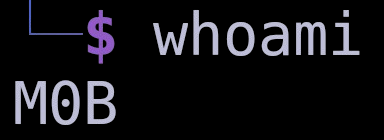

  

<h2>
	About Me:
</h2>

<ul align="justify">
	<li>🧑‍🎓 I am a Burp Suite Practitioner and a THM Junior Certified Pentester.</li>
	<li>🪲 Currently preparing for bug bounty hunting and reading HackerOne write-ups.</li>
	<li>💻 I enjoy working on Hack The Box machines and participating in CTF competitions.</li>
	<li>🐍 I write scripts, primarily with Python and Bash, to automate tasks and improve efficiency.</li>
	<li>🌐 I have a Web with my Obsidian notes : https://imm0b.github.io .</li>
</ul>

 

	 &nbsp;
	

